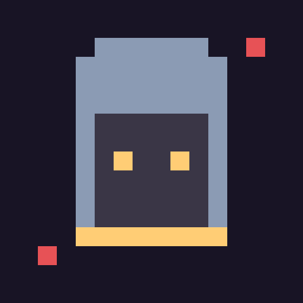
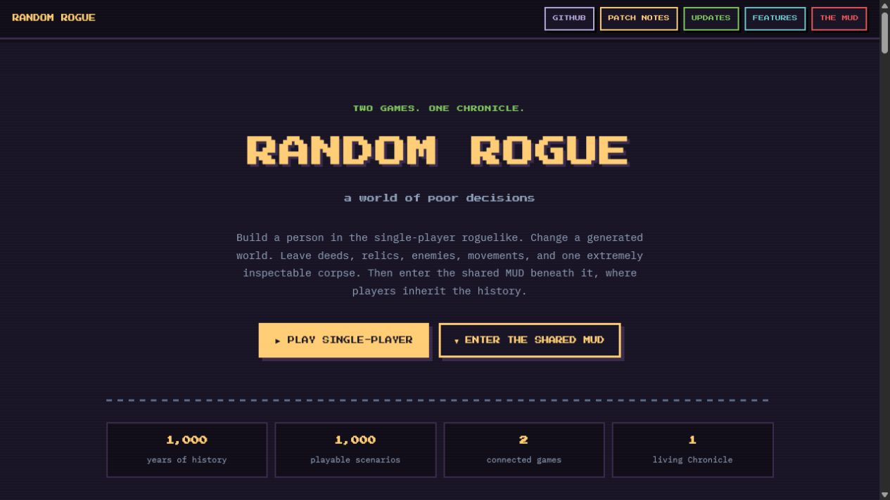
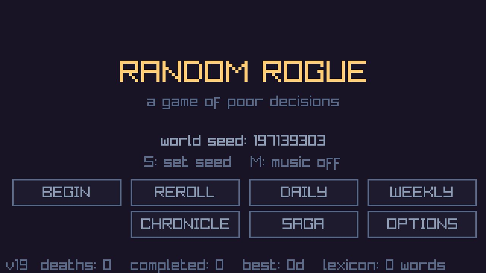
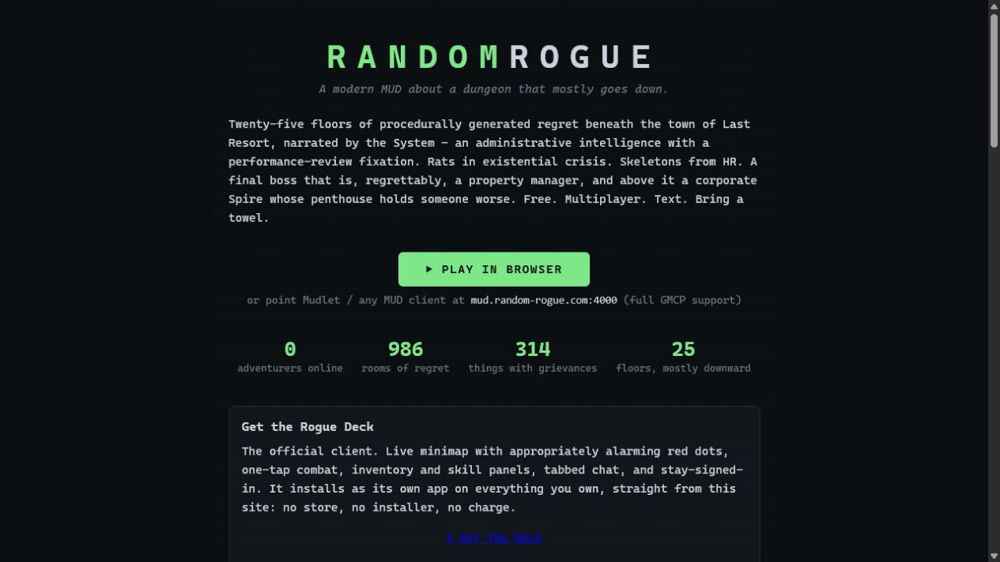
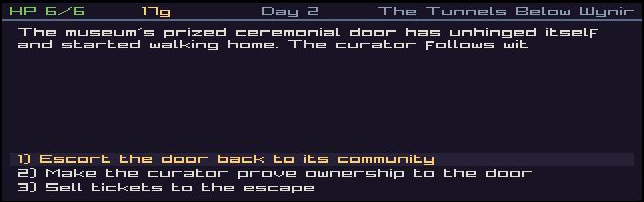
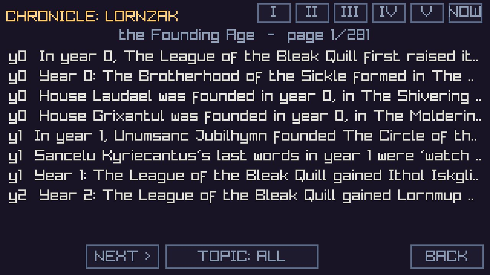

<p align="center">
  
</p>

<h1 align="center">Random Rogue</h1>

<p align="center"><strong>Two games. One Chronicle. A world of poor decisions.</strong></p>

<p align="center">
  A lofi choice-driven roguelike where every seed creates geography, factions, political economies, named people, artifacts, and 1,000 years of history. Your choices become permanent history, then cross into a shared multiplayer MUD.
</p>

<p align="center">
  <a href="https://random-rogue.com/"><strong>Play in your browser</strong></a>
  &nbsp;|&nbsp;
  <a href="https://mud.random-rogue.com/"><strong>Enter the shared MUD</strong></a>
  &nbsp;|&nbsp;
  <a href="https://theencryptedafro.itch.io/random-rogue"><strong>Play on itch.io</strong></a>
</p>

<p align="center">
  <a href="https://github.com/AES256Afro/RandomRogue/actions/workflows/build.yml"></a>
  
  
  
</p>



## Two games, one living world

| The Wide World, single-player | The MUD Below, multiplayer |
| --- | --- |
| Build a person, travel a generated world, choose among bad ideas, and permanently alter its Chronicle. | Explore a shared text world beneath the surface, meet other players, and inherit history created by single-player lives. |
| Each world has its own factions, wars, rents, labor struggles, ecology, institutions, people, relics, and memory. | Fallen characters, notable deeds, endings, institutions, regional changes, and recovered artifacts arrive through the signed Chronicle Bridge. |
| Fully playable offline after loading. | A live online world at [mud.random-rogue.com](https://mud.random-rogue.com/). |

<table>
  <tr>
    <td width="50%"></td>
    <td width="50%"></td>
  </tr>
  <tr>
    <td align="center"><strong>The single-player Wide World</strong></td>
    <td align="center"><strong>The connected multiplayer MUD</strong></td>
  </tr>
</table>

## What is inside

- **1,000 playable scenarios.** Every card has a primary political theme and material consequences. The deck covers labor, housing, anti-fascism, anti-war resistance, ecology, public care, freedom, failed revolution, and stubborn kindness.
- **A Story Director that fights repetition.** Exact events deal without replacement for an entire life. Saves preserve the seen set, and each world carries a 240-card cooldown across generations.
- **1,000 years of generated history.** Five eras produce factions, wars, gods, beasts, settlements, famous figures, disasters, artifacts, and rumors before the player is born.
- **Remembered campaigns.** Fifty-nine connected eight-beat families recall witnesses, earlier choices, betrayals, solidarity, and the consequences that followed.
- **Living institutions.** Join organizations, build standing, challenge their bureaucracy, seek office, influence their tendencies, or walk away.
- **Material politics.** Rent, supply, pollution, labor power, faction agendas, and regional conditions keep moving without waiting for the player.
- **Personal history.** NPC relationships, companions, contracts, marks, curses, careers, reputations, heirs, graves, relics, and ideological endings survive beyond one life.
- **Inventory with provenance.** Weapons, armor, food, tools, books, recordings, clues, treasure maps, vehicles, and strange loot carry descriptions tied to people, places, factions, or historical events.
- **Long-form adventures.** Dungeons, caves, cities, taverns, forests, deserts, swamps, coasts, mountains, sea voyages, beast hunts, mysteries, naval arcs, and spaceship endings all use the same choice-driven system.
- **Accessible browser play.** Keyboard, mouse, and touch support work on desktop and iPad. Reader text sizes, high contrast, reduced motion, portable saves, separate audio controls, and background autosave are included. Music is muted by default.

## Choices become history



Outcomes are not isolated flavor text. A choice can alter a relationship, institution, faction, region, material condition, later event family, ending, inherited legacy, or shared Chronicle record. The same apparent problem can resolve differently because the people, history, inventory, weather, reputation, traits, and political situation are different.

## The Chronicle



The Chronicle is an append-only history of the generated world and the lives played inside it. Entries can be opened to read their complete text. The same seed produces the same starting world on every supported platform.

The live M3 bridge uses a transactional Cloudflare D1 outbox and signed delivery. Six classes of single-player history can reach the MUD:

1. Deaths and epitaphs
2. Notable deeds
3. Completed lives and ideological endings
4. Durable institutions
5. Regional changes
6. Recovered artifacts

Every delivered projection keeps source identity so the MUD can rebuild its shared history without duplicating events. Single-player remains fully playable when the bridge or MUD is unavailable.

## Play

| Input | Action |
| --- | --- |
| `1-9` or tap | Choose an option |
| `Tab` or PACK | Open inventory and crafting |
| `Enter` or tap | Continue |
| `S` | Enter or reveal a world seed |
| `M` | Toggle music, muted by default |
| `F8` | Explain the Story Director |
| `F11` | Save a screenshot |

## Build locally

Random Rogue uses C++17, raylib, CMake, and JSON-authored content. CMake fetches raylib and nlohmann/json automatically.

### Desktop

Requirements: CMake 3.24 or newer, Ninja, and a C++17 compiler.

```console
cmake --preset windows-gcc
cmake --build --preset windows-gcc
build/windows/random_rogue.exe
```

For Linux or macOS, configure a standard release build:

```console
cmake -B build -G Ninja -DCMAKE_BUILD_TYPE=Release
cmake --build build
```

The executable must remain beside its `assets/` folder.

### Browser

```console
emcmake cmake -B build/web -G Ninja -DCMAKE_BUILD_TYPE=Release -DPLATFORM=Web
cmake --build build/web
npx http-server build/web -p 8087
```

Then open `random_rogue.html`. The CI workflow also produces ready-to-upload Windows, Linux, macOS, and web artifacts on every push to `main`.

## Content authoring and world design

Most content lives in JSON, so new events, items, quirks, traits, companions, prose recipes, and constructed languages do not require recompiling the game.

- [Authoring guide](AUTHORING.md)
- [Modding reference](MODDING.md)
- [World generation](WORLDGEN.md)
- [Narrative direction](NARRATIVE.md)
- [The 1,000-scenario recipe](SCENARIO_1000.md)
- [Chronicle and MUD bridge plan](MUD_WORLD_BRIDGE_PLAN.md)
- [Project plan](PLAN.md)

The content validator and Monte Carlo playtest tools check schema validity, event reachability, balance, deterministic generation, and scenario coverage. Native and WebAssembly Chronicle dumps must remain byte-identical for the same seed.

## Release and hosting

- [random-rogue.com](https://random-rogue.com/) is served by a Cloudflare Worker backed by KV.
- Shared Chronicle storage and reliable bridge delivery use Cloudflare D1.
- GitHub Actions builds all four targets and publishes the browser bundle.
- The itch.io release accepts the generated `random-rogue-web` artifact zip and supports mobile-friendly browser play.

Random Rogue is currently Release 19. The Chronicle Bridge is at M3, reliable one-way delivery from the single-player world into the MUD.
